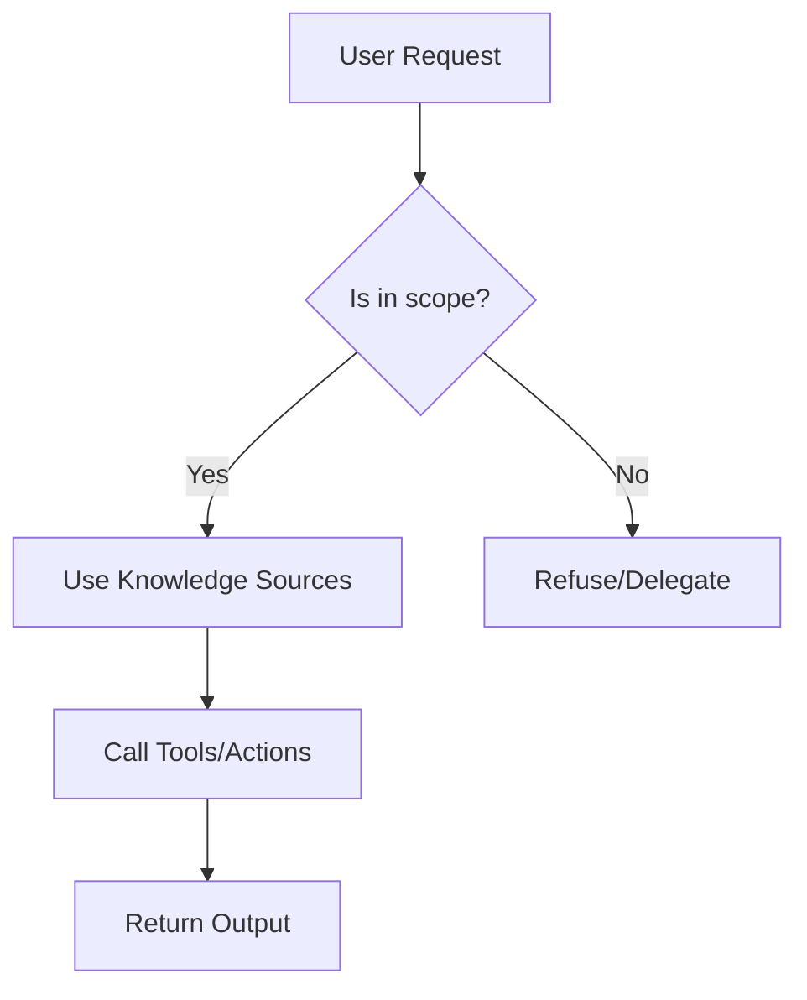

# Agent definition: <display-name>

## Description

Short description of when to use this agent.

## Target users

- <user group>

## Jobs to be done

- <task>

## Boundaries

See [agent-guardrails-matrix.md](agent-guardrails-matrix.md) for detailed permission modeling.

The agent must not:

- <boundary>

## Architecture Workflow

## Instructions

1. Understand the user's goal and available context.
2. Check whether the request is in scope.
3. Use the listed knowledge sources before guessing.
4. Use tools/actions only when they are necessary and safe.
5. Return concise, actionable output.
6. Call out assumptions, missing information, and follow-up work.

## Knowledge sources

- <source>

## Tools/actions

- <tool/action>

## Starter prompts

- <prompt>

## Acceptance criteria

- <criterion>
