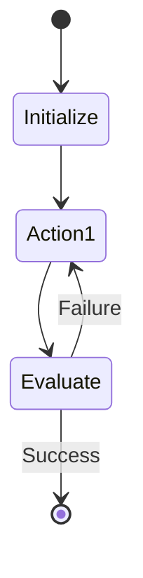

# Skill package template

```text
skills/<skill-name>/
├── SKILL.md
├── README.md
├── templates/
├── checklists/
├── security/
│   └── guardrails-matrix.md
├── references/
└── examples/
```

## SKILL.md frontmatter

```yaml
---
name: <skill-name>
version: 1.0.0
description: Use when <specific trigger context>. Triggers include: <keywords>.
dependencies:
  - toolset/mcp-github@^1.0
  - skill/agent-builder@^2.0
permissions:
  - read:workspace
---
```

## SKILL.md Architecture Workflow

Every skill should include a state diagram visualizing its workflow.

```markdown
## Workflow


```

## README.md sections

- Purpose
- When to use
- Inputs
- Outputs
- Included templates/checklists/references
- Validation

## Quality expectations

- Clear activation description
- Focused scope
- Progressive disclosure
- Realistic examples
- Eval or acceptance criteria
- No secrets or project-private assumptions
